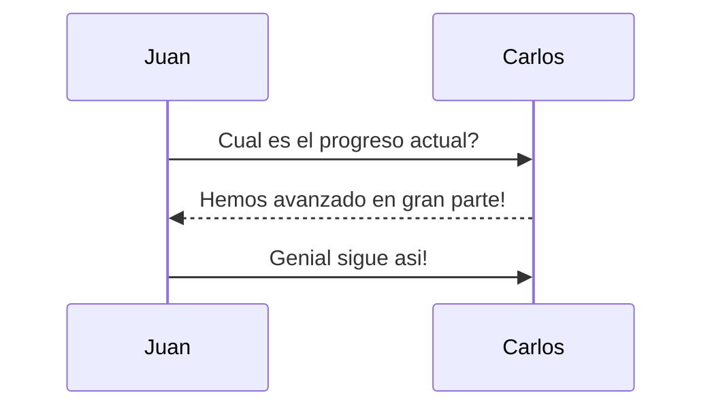

**Tabla de contenidos:**
 - [Encabezados](#enbezados)
 - [Listas](#listas)
 - [Enlaces](#enlaces)
 - [Imagenes](#imagenes)
 - [Enfasis](#enfasis)
 - [Tablas](#tablas)
 - [Codigo](#codigo)
 - [Diagramas](#diagramas)
 - [Elementos-adicionales](#elementos-adicionales)
 


# Enbezados 
- # Encabezado de nivel 1
- ## Encabezado de nivel 2
- ### Encabezado de nivel 3
- #### Encabezado de nivel 4
- ##### Encabezado de nivel 5
- ###### Encabezado de nivel 6


# Listas 

Listas no ordenadas: Para crear una lista no ordenada se pueden usar simbolos como ("+", "*", "-"), ademas dependiendo de su identacion su estilo puede cambiar

*       Lista 1 con identacion
+ Lista 2
- Lista 3 

Esta lista tambien puede ser anidada de la siguiente manera:
- Lista 1
    - Sublista 1
        - Sublista 2
            - Sublista 3
                - Sublista 4

Listas ordenada: En este tipo de listas se pueden usar numeros para seguir un orden numerico, con esta lista tambien funciona la identacion:

1.      Primer elemento con identacion
2. Segundo elemento
3. Tercer elemento

Tambien puede ser anidado de la siguiente manera:
1. Lista 1
    1. Elemento 1
    2. Elemento 2
        1. Sublista 1
            1. Elemento 1
            2. Elemento 2

# Enlaces

Este es un enlace de ejemplo: [ejemplo](http://google.com).


# Imagenes

La imagenes pueden ser desde un enlace en la web o una direccion en un directorio local


# Enfasis

Para hacer enfasis usando *cursiva* o __negrita__ en un determinado texto se puede envolver el texto entre asteriscos (*) o guiones bajos (_)

    Ejemplos:

- *cursiva*	
- _cursiva_	
- **negrita**	
- __negrita__

# Tablas

Para crear columnas se deben separar con el simbolo "|", y para las filas simplemente hacer una nueva linea y separarlas con el simbolo especificado:

|Columna 1|Columna 2| Columna 3 |
|--------|--------|--------|
|    A    |    B    |   C   |
|    D    |    E    |   F   |

# Codigo

Para escribir codigo se puden usar los siguientes simbolos "~" y "`", primero se debe indicar el tipo de codigo y despues colocar la estrutura del codigo

Html:
~~~ html
<html>
    <head>
    </head>
</html>
~~~

Java:   
``` java
public class Prueba {
    public static void main(String[] args){

    }
}
```

# Diagramas

Para que la visualizacion de los diagramas funcione, el IDE debe de tener el plugin necesario para visualizarlo, plataformas como gitlab y github ya tienen esta integracion de forma predeterminada.

Su uso es similar al codigo, solo se debe indicar el tipo de diagrama y su estructura

Por ejemplo para representar la conversacion entre dos personas:



# Elementos adicionales

Checklist
- [x] Tarea 1
- [ ] Tarea 2

Citas:

> Hola esto es una cita


***
Articulo separado por lineas
*** 
